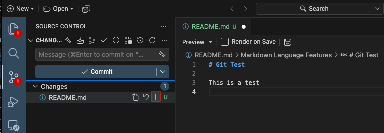
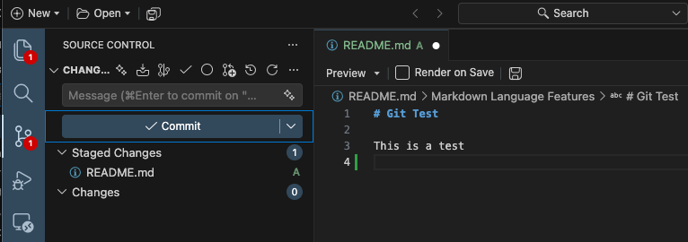

--- 
title: "Version control in VSCode"
subtitle: "Git and GitHub intro in VSCode"
author: "Daniel S. Mazhari-Jensen"
description: A translation of the R3 Git and GitHub intro lectures.
date: 2026-10-08
reading-time: 100 min
file-modified: 2026-10-08
categories: [Git, GitHub, VSCode]
format:
  html:
    toc: true
    code-fold: show
---

This material is a translation from [Reproducible Research in
R](https://r-cubed-intro.rostools.org/), which used R and RStudio. See the
[material at Zenodo](https://doi.org/10.5281/zenodo.3921893) and

> Johnston, L., Juel, H. B., Lengger, B., Witte, D. R., Chatwin, H.,
> Christiansen, M. R., & Isaksen, A. A. (2021). r-cubed: Guiding the overwhelmed
> scientist from random wrangling to Reproducible Research in R. *Journal of
> Open Source Education, 4*(44).

## Pre-lecture material:

### Install Git

::: panel-tabset
### Windows

1. [VSCode](https://code.visualstudio.com/download): Click the link.

2. [Git](https://git-scm.com/download/win): Select the "Click here to download"
   link. Git is used throughout many sessions in the workshop. When installing,
   it will ask for a selecting a "Text Editor" and while we won't be using this
   in the workshop, Git needs to know this information so choose Notepad.

### MacOS

1. [VSCode](https://code.visualstudio.com/download): Click the link or use
   Homebrew:

   ```bash {filename="Terminal"}
   brew install --cask visual-studio-code
   ```

2. [Git](https://git-scm.com/download/mac): Git is used throughout many sessions
   in the workshop. With Homebrew:

   ```bash {filename="Terminal"}
   brew install git
   ```

   If you don't use Homebrew, you can download and install Git as you normally
   would by clicking the link above.

### Linux (Ubuntu)

1. [VSCode](https://code.visualstudio.com/download):

2. [Git](https://git-scm.com/download/mac).

   ```bash {filename="Terminal"}
   sudo apt install git
   ```
:::

Windows users tend to have more trouble with installing Git than macOS or Linux
users. See the section on [Installing Git for
Windows](https://happygitwithr.com/install-git.html#install-git-windows) for
help.

### Make a GitHub account

After you are done, you need to [create a GitHub
account](https://github.com/join). Remember or record your username, as we will
ask you for it in the pre-workshop survey. Make sure to **remember your
password**, ideally saving it in your [password
manager](https://en.wikipedia.org/wiki/Password_manager) if you installed one
already or during the pre-workshop tasks so that it can store your password for
you.

Now you're ready to learn Git and GitHub! See you at the lecture 🎉

# Version control with Git {#sec-version-control}

Tracking what changes have been made to your files is an incredibly useful tool
for managing your analysis project. It also makes it much easier to collaborate
with others (like yourself in the future) and to share your work. Sharing your
analysis code is a critical step in ensuring your research is reproducible. This
session will cover what version control is and how to do it using Git within
VSCode.

## Reading task: What is version control? {#sec-what-is-version-control}

::: {.callout-note collapse="true"}
## Instructor note

For the reading parts, let them read it first and then walk through the material
again, to reinforce the importance of version control and doing it formally. So
give them a heads up that you'll be repeating things, specifically to reinforce
the concepts.

It's important in this session to go **slowly**. Version control is a
challenging topic and isn't something most people have ever learned about or
dealt with. So take it slow and make sure everyone is on the same page.
Frequently to assess how everyone is doing.
:::

**Time: \~8 minutes**

::: callout-warning
This session is *very* text and reading heavy compared to other sessions. This
is mostly because this topic requires a mental paradigm shift in how you view
files, and requires you to change your habits of how you normally work. Knowing
and using version control concepts and tools will fundamentally change how you
work over the long term. While the concepts are quite difficult, the tools to
use the concepts aren't, and using them often will make the concepts easier to
understand.
:::

{#fig-version-control-comics}

{#fig-filenaming-version-control-comics}

Does this way of saving files and keeping track of versions look familiar? While
the above images are teasing a bit, there is truth to it: It is the most
commonly used "version control".

This form of version control, while common, is fairly primitive, informal, and
very manual. It isn't ideal because it requires making multiple copies of the
same file, even if changes are made to only one small part of the file. This
approach also makes it difficult to find specific changes.

There are, however, formal version control systems that automatically manage
changes to a file or files. These formal version control systems take snapshots
of changes done to files, which are usually called "revisions" or "commits".
These "commits" record what was changed since the previous "commit". When you
make these "commits", you have to create a short message on what or why you made
a change. These "commits" and their messages are stored as a log entry in a
history. This history then has all this information, for each commit, on which
file or files were changed, what was changed within the file(s), who changed it,
and a short message about the change. This is extremely useful, especially when
working in teams, or for yourself 6 months in the future (because you *will*
forget things), since you can go back and quickly see what happened and why.

To understand how incredibly powerful version control is, think about these
questions:

- How many files of different versions of a scientific documents or thesis do
  you have laying around after getting feedback from your supervisor or
  co-authors?
- Have you ever wanted to experiment with your code or your report and need to
  make a new file so that the original is not modified?
- Have you ever deleted something and wish you hadn't?
- Have you ever forgotten what you were doing on a project, or why you chose a
  particular strategy or analysis?

All these problems can be fixed by using formal version control! There are so
many good reasons to use version control, especially in science:

- Transparency of work done to demonstrate or substantiate your scientific
  claim.
- Claim to first discovery, since you have a time-stamped history of your work.
- Defense against fraud, because of the transparency.
- Evidence of contributions and work, since who does what is tracked.
- Keeping track of changes to files easily, by looking at the history of
  changes.
- Easy collaboration, because you can work on a single file/folder rather than
  emailing versions around.
- Organized files and folders, since there is one single project folder and one
  single version of each file, rather than multiple versions of the same file.
- Less time finding things, because everything is organized and in one place.

In this session we'll be covering a version control tool called
[Git](https://git-scm.com/book/en/v2/Getting-Started-What-is-Git%3F). While Git
on its own can be quite difficult to use, VSCode thankfully has an amazing and
straight-forward integration to it.

## Reading task: What is Git? {#sec-what-is-git}

**Time: \~5 minutes**

Git is one of several version control system tools available. It was developed
to help software programmers to develop and manage their work on
[Linux](https://en.wikipedia.org/wiki/Linux) (an operating system like Mac or
Windows). Sadly, it was designed by and for software programmers and not for
non-programming users like us researchers. So why do we teach it? Because Git
has so many great features that fit with how science and data analysis is done.

- Like Python, it is open source, so it's free and anyone verify how trustworthy
  and correct the code is.
- It is very popular and so has a very large online community that provides
  support, documentation, and tutorials on how to use it.
- The vast majority of open source projects and work, such as making Python
  packages, are done using Git and are hosted on [GitHub](https://github.com/),
  which is a company that hosts Git "repositories" (i.e. projects) online.
  - For example, the source code for
    [VSCode](https://github.com/microsoft/vscode) and
    [pandas](https://github.com/pandas-dev/pandas) are on GitHub.
- There are many open scientific projects that use Git and are hosted on GitHub,
  e.g. [rOpenSci](https://github.com/ropensci) organization or [MRC Integrated
  Epidemiology Unit](https://github.com/MRCIEU).
- VSCode has an amazing interface and integration with Git.

While learning Git and version control can be difficult and has a steep learning
curve, like learning Python, it is ultimately an investment into your future
productivity and effectiveness as a researcher. It is *very much worth it* to
learn and use it as often as you can.

While many people may use Git to manage their Python scripts, you can also
manage other non-code based files like Word or images in Git. Version control is
useful for any project that uses any type of files since they can be saved in
the Git history (though there are some limitations to using Git for files that
are not plain text like R scripts are). You can save files into the history by
adding and committing them (as we will learn to do shortly).

## Reading task: Basics of Git {#sec-basics-of-git}

::: {.callout-note appearance="minimal" collapse="true"}
## Instructor note

Make sure everyone has their Git properly configured. Reinforce the Git repo =
one R project = one research project.
:::

**Time: \~8 minutes**

Git works by tracking changes to files *at the project level* (i.e. for every
Python Project). So you won't track your entire, for instance, `Documents/`
folder. When file changes are saved and put into the history, this history is
called a "repository" (also called a "repo" for short). We'll explain more about
what a repository is later. What you do with Git is more or less to:

- Set up Git in your project or folder by starting it as a "repository".
- Tell Git to track a file by preparing it to be saved to the history.
- Save changes to files in the history with a message you recorded about the
  change.

Other things you can do with Git:

- Check what's been changed or added in your files since the last save.
- Check the history for what was previously changed or added.

When working with GitHub, there are extra things you can do (more on this
later):

- Synchronize the Git repository on your computer with the repository on your
  GitHub, called "push" (upload) and "pull" (download).

So first off, *what exactly is the Git repository?* The Git repository works at
the project (the folder) level because it stores the version history in the
hidden `.git/` folder as shown in the file diagram below. In Windows, this
folder will probably not be hidden, but in Mac and Linux, files and folders that
start with `.` are automatically hidden. The `.git/` folder itself is the
repository used by Git to store the file changes and history of the project. So
don't delete it!

Another important file for managing the repository is the `.gitignore` file.
This file tells Git to *not* track (or "watch") certain files, such as temporary
files. This is *particularly* important for making sure you don't save personal
data in the Git history. Personal sensitive data should be stored in a *secure
location* and should *only* be accessed in the R Project by loading it from that
secure location.

```
├── .git/ <-- Git repository stored here
├── src/
├── data/
├── data-raw/
├── docs/
├── .gitignore <-- Tells Git which files NOT to save
└── README.md
```

Setting up a Git repository can be done in several ways:

- Using the VSCode interface
- Using the `git` command-line interface (CLI).
- Using tools like `uv`

What should a Git repository contain? In general, a common pattern is that one
Git repository is one VSCode Project, which should be one research project. This
helps ensure your project is reproducible and makes things much easier to manage
and share as you work on the project.

## Using Git in VSCode

::: {.callout-note collapse="true"}
## Instructor note

Since they will be using the Git interface quite a bit, really take your time
walking through it and describing it. Show where things are and what things to
focus on for this workshop.
:::

Git was initially created to be used in the terminal (i.e command-line).
However, because VSCode has a very nice interface for working with Git, we'll be
using that interface so we don't have to switch to another application. While
the terminal provides full access to Git's power and features, the vast majority
of daily use can be done through VSCode's interface.

To access the Git interface in VSCode, click the Git icon in the left sidebar
(see @fig-VSCode-git-button).

{#fig-VSCode-git-button}

First, we need to check whether git is installed in our system. We'll use the
terminal for this, since it is the afest and easiest way to do this.

1. In VS Code, select **Terminal** > **New Terminal**, then check that Git is
   available:

   ```bash
   git --version 
   ```

   You should see a Git version number. If the command isn't found, restart VS
   Code after installing Git. If it still fails, see [source control
   troubleshooting](https://code.visualstudio.com/docs/sourcecontrol/troubleshooting).

2. Configure the author name and email for your commits. Replace the
   placeholders with your details:

   ```bash
   git config --global user.name "<your-name>"
   git config --global user.email "<your-email>" 
   ```

The Git interface should look something like @fig-VSCode-git-interface below. A
short written description is given below the image.

{#fig-VSCode-git-interface}

::: {.callout-note collapse="true"}
## Instructor note

Do this part as a code-along, after having explained the above first.
:::

Now, let's make a project in order to see what the workflow actually look like
👀

First, we make a small `README.md` file, and see what happens when we click the
**Initialize Repository** button.

1. Make a folder on your laptop called `LearningGit` and open it inside VSCode.
2. Create a `README.md` file inside that folder.
3. Write some text inside (can be anything).
4. Go to the Source Control tap in the left bar and hit `Initialize Repository`.

In the Source Control panel, you should now see something like this:

::: {#fig-source-control-git-example layout-nrow="3"}





:::

1. This is the panel that lists the files that have been modified in some way.
   You add ("stage") files here that you want to be stored ("committed"). The
   top box is is the Commit Message box where you write the message about the
   changes that will be put into the history. Notice that there is a green `U` ---
   this symbolize untracked files.
2. By hovering the mouse on the file, we can (from left to right): view the
   changes, discard the changes, or stage changes.
3. After clicking stage changes, the file has been moved from "Changes" to
   "Staged Changes". Now, a green `A` has been added, symbolizing "add file to
   history".

In the Git interface, view the `README.md` file. You should see the text in the
file, all in green. Green means the text has been added. Red, which you will see
shortly, means text was removed.

A `README.md` file is an important document to orient people to your project.
Think of it as the "metadata" about your project, so it's a good idea to add
some basic explains about your project in it.

Now click the "Staged" checkbox besides the `README.md` file to get it ready to
be saved into the history. You've now "added" it to the staged area. Note that
when you have a lot of files to stage, you can stage them all at once. The box
on the top is where you type out your "commit" message. "Commit" means you save
something to the history of changes. You "commit" it to the history, like you
"commit" something to your own memory.

## Reading task: States of Git

::: {.callout-note collapse="true"}
## Instructor note

Verbally explain the below after they've read it to reinforce the concepts.
:::

**Time: \~5 minutes**

Before we move on, there are some things to know about how Git works. In Git,
there are three "states" that a file can be in, listed below and summarised in
@fig-git-states.

1. The *Working folder* state is where all files are, whether they are
   "untracked" or "tracked". Untracked is when Git sees the file, but it has not
   yet entered the history. Tracked is when the file has been saved in the
   history and Git "watches" it for changes.
2. The *Staged* state is when a file has a change that is different compared to
   the version in the history and it has been checked ("added") into the
   "Staged" area (by ticking the checkbox beside the file in the Git interface).
3. The *History* or *Committed* state is when a "commit" message has been
   written and the file with its changes has been saved into the repository
   history.

```{mermaid}
%%| label: fig-git-states
%%| fig-cap: The three states that files and folders can be in, when using Git.
%%| echo: false
%%| eval: true

%%{init:{'themeCSS': ".actor {stroke: DarkBlue;fill: White;stroke-width:1.5px;}", 'sequence':{'mirrorActors': false}}}%%
sequenceDiagram
    participant W as Working folder
    participant S as Staged
    participant H as History
    W->>S: Add
    S->>H: Commit
```

This system allows us to keep a journal (a *log*) of what has been changed, why
it has been changed, who changed it, and when. @fig-VSCode-git-interface-log
below shows an example log of the history of a project I'm currently working on,
which makes it easy to get an overview of what is happening in a project.

{#fig-VSCode-git-interface-log}

You may notice that the messages in the log give a bit of detail about why a
change was made, though it's not always the case. Sometimes a message like
"minor edit" is enough, because it was a minor edit.

A general tip for writing an effective commit message is to be *concise but
meaningful*. Writing down meaningful messages can save you a lot of time in the
future when you come back to a project after some time and forget what you were
doing. With a well written history you can get a quick idea or reminder about
the state of the project.

## Adding changes to the Git History

::: {.callout-note collapse="true"}
## Instructor note

For going over the Git history pane, demonstrate how you can open a file at that
commit, so that nothing is ever lost.
:::

Ok, now we will write something like "Add initial README file" in the commit
message box and commit the change. After clicking "Commit", you'll notice that
the `README.md` file is no longer on the left side. That's because we've put the
change into the history. We'll return to that shortly.

Next, open up the `README.md` file in VSCode using the Files tab. At the top of
the file, write your name and your favorite food, and then save the file. Open
up the Git interface again (with the Git icon. You should now see the added text
in green. Alright, now "Stage" the change (click the `+`), write a message like
"added my name to README file", and commit the change.

We can view the history in the Graph tab in the Git pane. Here you can see what
has been done in previous commits. The "Graph" section is quite powerful. As
long as you commit something into the Git history, it will never be completely
gone[^version-control-1]. For instance, we can see the full contents of a file
at a specific commit by clicking the commit, moving to the file you want to look
into, and clicking the commit and selecting the file of interest. Try that with
the second commit of the README file. It shows you what the file was like in
that commit, so we can always go back the changes we made there.

[^version-control-1]: This isn't completely true, you can delete stuff, like if
    you accidentally add a password or personal data.

A question that may come up is "how often should I commit"? In general, it's
better to commit fairly frequently and to commit changes that are related to
each other and to the commit message. Following this basic principle will make
your history easier for you to read and make it easier for others as well.

## Ignoring files with `.gitignore`

::: {.callout-note collapse="true"}
## :teacher: Teacher note

Reinforce that we don't always want Git to track everything. Make sure to
explain why we want to ignore generated files and what the `*` means (wildcard
for any characters).
:::

We already read about the `.gitignore` file earlier. There are actually some
files that we don't want to track as we work on our project. This could be
generated figures, documents, or other artifacts of the code, which is
unnecessary. It can also be sensitive data or personal notes. So let's tell Git
to not track a specific file named `/personal.md`.

We do two things:

1. Make the file `personal.md` in the root directory and type in your phone
   number. Notice that the `personal.md` file is automatically showing up in the
   "Changes" in the Git tab.
2. Make a file called `.gitignore` in the root directory. In the file, type in
   the following code:

```r {filename=".gitignore"}
personal.md
```

Let's stage and commit this change with a message like "Ignore generated HTML
files and folders". Notice that your phone number in `personal.md` is not
committed.

## Exercise: Committing everything to the history

**Time: \~15 minutes.**

When working on your own projects and when you use Git, you will be committing a
*lot* of changes to your files into the Git history. Part of the initial barrier
is simply getting used to this workflow of committing what you've changed. Use
this exercise to get some practice.

1. Practice the add-commit ("add to staging"-"committing to history") sequence
   by adding and committing code into the Git history. At the end, **all** of
   your files and folders should be committed to the history. While you could
   add and commit them all at once, we want you to do them one at a time so you
   practice using this workflow.
   - Make sure to write a meaningful and short message about what you added and
     why. In this case, the "why" is simply that you are saving the file into
     the history for the first time.

**Exercise 1: Calculate BMI from patient measurements**

A study collected height and weight from participants.

```python
import pandas as pd

patients = pd.DataFrame({ 
    "patientid": ["P01", "P02", "P03", "P04", "P05"], 
    "heightcm": [172, 165, 181, 158, 175], 
    "weight_kg": [68, 72, 85, 54, 91] 
})
```

**TODO:**

- Add a new column called "bmi".
- BMI = weight (kg) / height (m)^2

**Task:** Add the `bmi` column.

**Exercise 2: Find patients with high heart rate**

A nurse records resting heart rate during a clinical visit.

```python
import pandas as pd

patients = pd.DataFrame({ 
    "patientid": ["P01", "P02", "P03", "P04", "P05", "P06"], 
    "heartrate": [72, 88, 105, 64, 112, 79] 
})
```

**TODO:**

- Find all patients with a heart rate above 100 bpm.
- Store the result in a new DataFrame called "high_hr". print(high_hr)

**Task:** Use boolean filtering to find patients with `heart_rate > 100`.

**Exercise 3: Calculate average blood pressure**

Researchers measured systolic and diastolic blood pressure.

```python
import pandas as pd

bp = pd.DataFrame({ 
    "patient_id": ["P01", "P02", "P03", "P04", "P05"], 
    "systolic": [118, 135, 142, 125, 155], 
    "diastolic": [76, 82, 91, 79, 95] 
})
```

**TODO:**

- Calculate the mean systolic blood pressure.
- Calculate the mean diastolic blood pressure.

**Task:** Calculate both averages using pandas.

**Exercise 4: Classify patients by blood glucose**

**Scenario:** Blood glucose was measured during a screening study.

```python
import pandas as pd import numpy as np

patients = pd.DataFrame({ 
    "patientid": ["P01", "P02", "P03", "P04", "P05", "P06"], 
    "glucosemmol_l": [4.8, 6.1, 8.4, 5.2, 7.2, 3.9] })
```

**TODO:** Add a column called "glucose_status".

Use these categories:

- below 4.0 -> "low"
- 4.0 to 6.9 -> "normal"
- 7.0 or higher -> "high"

**Task:** Use `numpy.select()` or `np.where()` to create the classification.

**Exercise 5: Find the largest change in oxygen saturation**

Patients had their oxygen saturation (`SpO2`) measured before and after
treatment.

```python
import pandas as pd

patients = pd.DataFrame({ 
    "patientid": ["P01", "P02", "P03", "P04", "P05"], 
    "spo2before": [94, 91, 96, 89, 93], 
    "spo2_after": [97, 95, 97, 94, 96] 
})
```

**TODO:**

- Calculate the change in SpO2 for each patient.
- Add it as a column called "spo2_change".
- Then find the patient with the largest improvement.

**Task:** Calculate the difference and use `idxmax()` to find the largest
improvement.

**Exercise 6: Detect missing laboratory measurements**

**Scenario:** Some blood samples failed to produce a result.

```python
import pandas as pd import numpy as np

labresults = pd.DataFrame({ 
    "sampleid": ["S01", "S02", "S03", "S04", "S05", "S06"], 
    "hemoglobin": [13.2, 14.1, np.nan, 12.8, np.nan, 15.0], 
    "crp": [2.1, np.nan, 8.4, 3.2, 12.5, np.nan] 
})
```

**TODO:**

- Find out how many missing values there are in each laboratory measurement.

**Task:** Calculate the number of missing values in each column.

**Exercise 7: Compare treatment groups**

A small clinical study compares two treatments and records reduction in pain
score.

```python
import pandas as pd

study = pd.DataFrame({ 
    "patientid": ["P01", "P02", "P03", "P04", "P05", "P06"], 
    "treatment": ["A", "A", "A", "B", "B", "B"], 
    "painreduction": [2, 3, 4, 5, 4, 6] 
})
```

**TODO:**

- Calculate the average pain reduction for treatment A and treatment B.

**Task:** Use `groupby()` to calculate the mean for each treatment.

**Exercise 8: Combine patient data with lab results**

Patient information and laboratory measurements were stored separately. Before
analysis, they need to be combined.

```python
import pandas as pd

patients = pd.DataFrame({ 
    "patient_id": ["P01", "P02", "P03", "P04"], 
    "age": [34, 52, 47, 61], 
    "sex": ["F", "M", "F", "M"] })

labs = pd.DataFrame({ 
    "patient_id": ["P01", "P02", "P03", "P04"], 
    "hemoglobin": [13.4, 14.8, 12.9, 13.7],
    "crp": [1.2, 4.5, 2.1, 8.3] 
})
```

**TODO:**

- Merge the two DataFrames using "patient_id".
- Store the result in "patient_data".

**Task:** Use `pd.merge()` to combine the demographic and laboratory data.

## Summary

- Use the version control system Git to track changes to your files, to more
  easily manage your project, and to more easily collaborate with others.
- Git tracks files in three states: "Working directory", "Staged", and
  "History".
  - The Git repository contains the history.
- The main actions to move between states are:
  - "Add to staging"
  - "Commit to history"
- When committing to history, keep messages short and meaningful. Focus more on
  **why** the change was made, not what.
- Almost all Git actions can be done using VSCode's Git interface.

# Collaborating with GitHub {#sec-github}

GitHub is a popular online service for hosting Git repositories. It also makes
collaborating on projects much easier. In this session, we will cover what
GitHub is and how to use it with your R project that is a Git repository.

## "Remotes": Storing your repository online {#sec-remotes-setting-up}

::: {.callout-note collapse="true"}
## Instructor note

Briefly go over this next section, especially highlighting the image.
:::

A version control system that didn't include a type of external backup wouldn't
be a very good system, because if something happened to your computer, you'd
lose your Git repository. In Git, this "external" backup is called a "remote",
meaning it is something that is separate and in a different location, usually
online, than the main repository. The remote repository is essentially a
duplicate copy of the *history*, found in the `.git/` folder, of your *local*
repository on your computer. So when you synchronize with the remote, as
illustrated in @fig-git-remotes, it only copies over the changes made as commits
in the history.

One of the biggest reasons why we teach Git is because of the popularity of
several Git repository hosting sites. The most popular one is
[GitHub](https://github.com/) (which this lecture is hosted on). In this
session, we'll be covering GitHub not only because it is very popular, but also
because the Python community is almost entirely on GitHub.

```{mermaid}
%%| label: fig-git-remotes
%%| fig-cap: The 'remote' vs 'local' repository, or online vs on your computer.
%%| echo: false
%%| eval: true

graph TB
    linkStyle default interpolate basis
    A('Remote':<br>GitHub) --- B('Local':<br>Your computer)

    style A fill:White,stroke:DarkBlue,stroke-width:1.5px;
    style B fill:White,stroke:DarkBlue,stroke-width:1.5px;
```

Let's get familiar with the GitHub interface.

::: {.callout-note collapse="true"}
## Instructor note

Go over the interface of GitHub, especially where repositories are listed, the
sidebar of the landing page (of your account), and where your account settings
are.

Also, reinforce the warning and note below.
:::

::: {.callout-warning appearance="default"}
When using GitHub, especially in relation to health research, you need to be
mindful of what you save into the Git history and what you put up online. Some
things to think about are:

- **Do not** save any personal or sensitive data or files in your Git
  repository.
- Generally don't save very large files, like big image files or large
  (non-personal) datasets.

In both cases, it's better to use another tool to store files like that, rather
than through Git and GitHub.
:::

::: callout-note
Some research projects require working on restricted server environments (such
as [Denmark Statistics](https://www.dst.dk/en) when doing research on the Danish
register data), where access to the internet is not available. This means that
you can't use GitHub or any other online Git repository hosting service.
However, you can still use Git on those servers without using a remote.
:::

## Reading task: Using GitHub as a remote

**Time: \~3 minutes**

Making and cloning a GitHub repository is the first step to linking a local
repository to a remote one. We are creating a GitHub repository from an existing
local one, but you can also create one on GitHub first.

After connecting your local Git repository, to keep your GitHub repository
synchronized, you need to "push" (upload) and "pull" (download) any changes you
make to the repository on your computer, as shown in @fig-git-remotes-synch. It
isn't done automatically because Git is designed with having control in mind, so
you must do this synchronization manually. "Pushing" is when changes to the
history are uploaded to GitHub while "pulling" is when the history is downloaded
from GitHub.

```{mermaid}
%%| label: fig-git-remotes-synch
%%| fig-cap: "Synchronizing with GitHub: 'Pushing' and 'pulling'."
%%| echo: false
%%| eval: true

graph TB
    linkStyle default interpolate basis
    A('Remote':<br>GitHub) -- Pull --> B('Local':<br>Your computer)
    B -- Push --> A

    style A fill:White,stroke:DarkBlue,stroke-width:1.5px;
    style B fill:White,stroke:DarkBlue,stroke-width:1.5px;
```

So, when we put the concepts back into the framework of the "states", first
introduced in @sec-basics-of-git, pushing and pulling *happen only to the
history*. Things that you've changed *and then* saved to the history, either on
the remote or the local repository, are synchronized from or to GitHub. So, as
shown in @fig-git-states-with-github, pushing copies of the history over to
GitHub and pulling copies of the history from GitHub. Since changes saved in the
history also reflect the working folder (the files and folders you actually see
and interact with), "pulling" also updates the files and folders.

```{mermaid}
%%| label: fig-git-states-with-github
%%| fig-cap: Which states get 'pushed' and 'pulled'.
%%| echo: false
%%| eval: true

%%{init:{'themeCSS': ".actor {stroke: DarkBlue;fill: White;stroke-width:1.5px;}", 'sequence':{'mirrorActors': false}}}%%
sequenceDiagram
    participant W as Working folder
    participant S as Staged
    participant H as History
    participant R as GitHub
    W->>S: Add
    S->>H: Commit
    H->>R: Push
    R->>H: Pull
    R->>W: Pull
```

Interacting with GitHub through VSCode requires us to use something called a
"personal access token", which you will learn about and create in the next
exercise.

## Reading task: Authenticating with GitHub

Accounts (lower left of side bar) --- link GitHub

## Linking your project to GitHub

- publish branch ?

Now that we have authenticated ourselves to GitHub, we can connect our project's
Git repository to GitHub. If you are new to Git and GitHub, we strongly
recommend starting your first work project(s) as private, in case you
accidentally add files you aren't supposed to. It will also help get you get
more comfortable with using Git and GitHub. However, for this class, we will be
keeping it public.

Now, whenever you use Git and save your changes to the Git history, whenever you
"Push" your changes it will be sent to your project on GitHub. The diagram below
shows how it conceptually looks like:

```{mermaid}
%%| label: fig-local-vs-remote
%%| fig-cap: Schematic showing a local repository connected to GitHub's remote
%%|   repository.
%%| echo: false
%%| eval: true

%%{init:{'theme':'forest', 'flowchart':{'nodeSpacing': 20, 'rankSpacing':30}}}%%
graph LR;
    yours(Your local) -->|Push| github(GitHub)
    github -->|Pull| yours
```

The "Your local" is your own computer. Whenever you "push" to GitHub, it means
it will upload your file changes (like synchronizing in Dropbox). Whenever you
"pull" from GitHub, it takes any changes made on GitHub and downloads them to
your "Local" computer.

Using GitHub (because of Git) is one of the most effective ways to collaborate
on a project. Hundreds of companies and hundreds of thousands of workers use Git
and services like GitHub to work together on massive projects. The way
collaboration works would conceptually look like:

```{mermaid}
%%| label: fig-local-collab-and-remote
%%| fig-cap: Schematic showing a local repository, GitHub's remote repository,
%%|   and a collaborator's repository.
%%| echo: false
%%| eval: true

%%{init:{'theme':'forest', 'flowchart':{'nodeSpacing': 20, 'rankSpacing':30}}}%%
graph LR;
    yours(Your local) -->|Push| github(GitHub)
    github -->|Pull| yours
    others(Collaborator's<br>local) -->|Push| github
    github -->|Pull| others
```

This approach to collaborating makes it much easier to contribute *directly*
(not through emails) to projects and to more easily help others out with issues.

## Synchronizing with GitHub

::: {.callout-note appearance="minimal" collapse="true"}
## :teacher: Instructor note

Go through this section slowly, remembering to make use of the stickies/origami
hats to check that everyone is following along.
:::

After we've created the token and put our project onto GitHub, we can now push
and pull any changes you make to the files. Let's practice how it works.

Now time to test out pushing the change to GitHub. Click the "Push" button in
the top right corner of the Git interface. A pop-up will indicate that it's
pushing and will show some text after it's pushed. Go to our GitHub repository
to see that it worked!

Now let's try the opposite way, by making a change on GitHub, committing the
changes there, and then pulling changes from GitHub to your local repository (on
your computer).

While in your `LearningGit` GitHub repository, click the `README.md` file there.
Then click the "Edit" button (the pencil icon) in the top right corner of the
file view. You'll be taken to a web-based editor.

Write another random sentence somewhere near the top of the file. Scroll down to
the commit message box, and type out a commit message. Then, click the "Commit"
button. We've now made a change on the repository in GitHub. Let's synchronize
it to our local repository.

Go back to VSCode, open the Git interface and now click the "Pull" button in the
top right corner beside the "Push" button. Wait for it to finish pulling and
check your `README.md` file for the new change. You've now updated your project!

## Reading task: Collaborating using Git and GitHub

::: {.callout-note appearance="minimal" collapse="true"}
## Instructor note

After they've read the text, briefly go over the image and emphasize why
collaborating this way makes things easier. If you have some personal
experiences, please share them!
:::

**Time: \~10 minutes**

While Git and GitHub are useful on even when you work alone, it's main and
biggest advantage is that it makes it much easier to collaborate with others on
a project.

Academia is unfortunately far behind when it comes to using modern tools to
effectively collaborate together. Most researchers still use emails to send Word
or other files back and forth, and while this is a very simple and non-technical
way to collaborate as it requires very little learning or training to use, it is
*not* very effective.

Usually this style of collaborating revolves around one or two people doing most
of the actual writing or direct contributing, while others give feedback or
indirectly contribute through discussions or meetings. You might be familiar
with using "Track changes" in Word when doing this style of collaborating. If
your collaborators are a bit more technical, you all might be using Google Docs
to do real-time collaboration together.

When you use Git and GitHub and write in Quarto documents, this style of
collaborating isn't possible. For one, there is no "track changes" feature in
Quarto documents. Instead, you need to use another way of collaborating, one
that is much more effective and extremely powerful. This workflow of using Git
and GitHub has been tried and tested by tens of thousands of teams in tens of
hundreds of companies globally. One of the goals of this workshop is to slowly
move researchers more into the modern era, using more modern technology, tools,
and workflows so that we can produce better research faster.

How does the workflow look like when using Git and GitHub? It works by using the
concept of remotes that we introduced earlier. Since a local repository is a
copy of a remote repository, anyone else can collaborate on your project by
copying the remote repository. When they want to contribute back, they make
commits to their local copy and push those changes up to the remote. Then you
can pull those changes to your local repository and do the same thing by
committing and then pushing. This is illustrated in
@fig-git-remotes-collaborate.

```{mermaid}
%%| label: fig-git-remotes-collaborate
%%| fig-cap: Collaborating with others using Git and GitHub by having a shared
%%|   central GitHub repository.
%%| echo: false
%%| eval: true

graph TB
    linkStyle default interpolate basis
    A('Remote':<br>GitHub) -- Pull --> B('Local':<br>Your computer)
    B -- Push --> A
    A -- Pull --> C('Local':<br>Collaborator's<br>computer)
    C -- Push --> A

    style A fill:White,stroke:DarkBlue,stroke-width:1.5px;
    style B fill:White,stroke:DarkBlue,stroke-width:1.5px;
    style C fill:White,stroke:DarkBlue,stroke-width:1.5px;
```

A disadvantage to this workflow is, in order to use it to effectively, it takes
time to learn and get used to. For instance, you may think that you can just
collaborate with others by making changes directly to the same file at the same
time. But a problem comes up when you both push and pull changes to the same
file. You will encounter something called a "merge conflict", which you'll have
to learn how to resolve. Git knows that changes were made to the same file, but
it doesn't know which change to keep and which to discard. You have to manually
resolve the conflict by opening the file and deciding which change to keep.

So, how do you manage this when collaborating with others? Always dealing with
merge conflicts sounds time-consuming and frustrating, doesn't it? Well, that's
because Git wasn't designed for that style of collaborating. Instead, Git uses a
concept called
["branches"](https://docs.github.com/en/pull-requests/collaborating-with-pull-requests/proposing-changes-to-your-work-with-pull-requests/about-branches)
to more effectively manage multiple collaborators working on the same project.
However, branches are a bit more of an advanced topic that we won't be covering
in this workshop. Instead, when collaborating with others, we recommend that
each collaborator create their own separate file to work on. For instance, if
you are collaborating on writing a report together, each collaborator would
create their own Quarto document to write in. When everyone is finished writing,
one person can then merge all the documents together into one final report. This
way, you avoid merge conflicts entirely. This is the approach we will get you to
use for the team project at the end of this workshop.

::: callout-tip
For public GitHub repositories, anyone can copy your repository and contribute
back (only if you want their contribution), so working with collaborators is
easy. When you have a private repository, you need to explicitly add
collaborators in GitHub.

You add someone to a private (or public) repository by going to "Settings \>
Manage Access \> Invite a collaborator". We won't do this for the workshop, but
we're telling you how you can just in case you want to after the workshop.
:::

::: callout-tip
As we mentioned, when working with others (or even yourself) through GitHub, you
will eventually encounter "merge conflicts". This happens when a change has been
made to the same line in the same file, but in different commits, either by you
or someone else. This usually happens if you make a change on GitHub as the
remote while also making a change on your local repository without pulling
first.

When this happens, Git will not know which change to keep and will ask you to
resolve the conflict. You resolve the conflict by opening the file in RStudio,
finding the conflict, and deciding which change to keep and which to remove.
After you've resolved the conflict, you would then stage the file and commit it.

We won't go into merge conflicts in this workshop, though you might deal with
them during the team project. If you want to learn more about them after the
workshop, GitHub has a [practical
tutorial](https://github.com/skills/resolve-merge-conflicts) on it. We also have
an extra appendix section to deal with merge conflicts in @sec-merge-conflicts.
:::

::: callout-note
A big challenge you'll encounter with becoming better with this way of
collaborating is that most of your collaborators will likely not be familiar
with it.

Sadly, even experienced researchers struggle with this workflow (mainly due to
not being familiar with Git) and there is no easy answer on how to handle this.
The best way (in our opinion) is to start training any colleague who is
interested in collaborating this way and slowly surround yourself with
collaborators who also work this way.
:::

::: callout-tip
Want to see how others use Git and GitHub in their research as examples? Check
out the [Examples](https://guides.rostools.org/learning#examples) section of the
rostools Guides website.
:::

## Summary

- "Remotes" are external storage locations for your Git repository. GitHub is a
  popular remote repository hosting service.
  - Downloading a Git repository from GitHub is called "cloning".
- "Pushing" and "pulling" are actions to upload and download to the remote
  repository (which usually is called "origin"), so that you can synchronize
  your changes.
- Collaborating together using Git and GitHub is a powerful way of working, but
  does take some learning. Collaborating involves each collaborator creating a
  copy of the remote repository that you each push and pull to as you work
  together.

# Final exercises

You will be collaborating as a team using Git and GitHub to manage your team
assignment. We will set up the project with Git and GitHub for you so you can
quickly start collaborating together on the project. You will be pushing and
pulling a lot of content, so you will need to maintain regular and open
communication with your team members.

## Clone the team repository

All team members need to clone (download) your team's repository to their own
computer. Open the command pallet and look for `Git: Clone`. Then, paste your
team's repository URL (copied from the team's repository page on GitHub) into
the "Repository URL" box. After you clone the repository in VSCode, it should
open up as a Project for you.

## Download the dataset

Each team member needs to **download the dataset** for the project work and save
the file into the `data/` folder of the R project. We already set the project to
ignore the `data/` folder, so the data will not be tracked by Git. There are two
ways to download the dataset:

- Manually download the dataset and move it from your `Downloads/` folder of
  your computer into the R project's `data/` folder by using your file manager
  (like Finder or File Explorer). Use [this
  link](https://zenodo.org/records/8292712/files/SUA_CVDs_risk_factors.csv?download=1)
  to directly download the data.

- Or, run this code below:

```python
import urllib.request
from pathlib import Path

url = "https://zenodo.org/records/8292712/files/SUA_CVDs_risk_factors.csv"
destfile = Path("data/SUA_CVDs_risk_factors.csv")

urllib.request.urlretrieve(url, destfile)
```

## Create individual scripts

In order to avoid merge conflicts, make a script that you will be working on.

### Create some figures and tables

This task will take the most amount of time. We want each team member to create
a few figures and tables. Ideally, each team member would create *different*
figures and tables, so that you get practice on your own. So this will require
some coordination and communication between team members.

::: callout-tip
You can do any wrangling, plotting, and table-making that you want, as long as
you use the code and techniques you learned during the workshop. Just to remind
you, you can wrangling and analyse the data any way you want, even if
technically it might not make sense or be wrong. The point of this project is to
practice what you learned and have fun along the way.
:::

::: callout-important
Keep the figures and tables simple. The simpler the better. The goal is to
practice what you learned, not to create a perfect analysis.
:::

To help you get started or to give you some ideas, here are some plots and
tables you could make:

- A table of the mean of `Age` and `BMI` (using `groupby()` and `mean()`)
  grouped by `Sex`. Display the table with `print()`.

- A table of the mean of `Age`, `BMI`, `SBP`, and `DBP` (using `groupby()` and
  `mean()`) grouped by `hypertension` (or `dyslipidemia` or `hyperglycemia`).
  Display the table with `print()`.

- A histogram of `BMI` with `sns.histplot()`, with `hyperglycemia` as the `hue`
  or using separate plots with `col=`.

- A scatter plot of `SBP` vs `DBP` with `sns.scatterplot()`, colored by
  `hypertension` (optionally with a `sns.regplot()` or `sns.lmplot()` trend
  line).

- A bar plot of the counts of `hyperglycemia` status with `sns.countplot()`,
  making separate plots for `Times` using `col=`.

- A boxplot of `TC` (total cholesterol) by `dyslipidemia` status with
  `sns.boxplot()`.

- Find the mean `BMI` by `hyperglycemia` using `groupby()` and `mean()`, and
  create a bar plot with `sns.barplot()`.

We suggest that you talk with your team members to get some other ideas or to
decide who does what. As you code, get or give help to your teammates.

### Regularly commit the changes

Use the "Git workflow" by adding to the staged area, committing, pushing, and
pulling the changes you and your teammate have made. You may encounter merge
conflicts. If you do, get one of the helpers or teachers to help you out!

### Testing each others code for reporducibility

When a figure or table is completed and committed, the teammate should pull and
try to replicate the table or figure using the code in the teammates script
file.

## Expectations for the project

What we expect you to do for the team project:

- Use Git and GitHub throughout your work.
- Work collaboratively as a team and share responsibilities and tasks.
- Use as much of what we covered in the workshop to practice what you learned.

What we don't expect:

- Complicated analysis or coding. The simpler it is, the easier is to for you to
  do the coding and understand what is going on. It also helps us to see that
  you've practiced what you've learned.
- Clever or overly concise code. Clearly written and readable code is *always*
  better than clever or concise code. Keep it simple and understandable!

Essentially, the team project is a way to reinforce what you learned during the
session, but in a more relaxed and collaborative setting.
