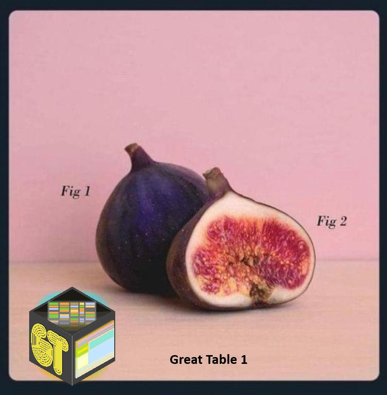

{.preview-image}

# The Table 1

The table 1 is an infamous piece of almost every experimental study involving human subjects or participants. Table 1 is typically the first table in a paper and provides an overview of the study population, summarizing key demographic and baseline characteristics such as age, sex, clinical variables, and other relevant measures. Its purpose is to give readers a quick sense of who the participants are and whether the groups being compared (for example, treatment vs. control) appear similar at baseline.

The content of the table is often explicitly stated in the statistical analysis plan (SAP). In planned studies with FDA/EDA approval, such tables are submitted in advance of conducting the study in order to get the approval. Even in the case of smaller experiments, researchers are well aware of the relevant background information which goes into the Table 1.

## Making a template for the Table 1

Making human-readable code is important. To achieve this, we'll use `tibble::tribble()`. This function creates tibbles using an easier to read row-by-row layout. This is useful for small tables of data where readability is important.

**Tip for AIR users**

If you're using a formatter ({Styler}, {Air} etc.), sometime, it's more a noisance than a help. For `tibble::tribble()`, noisance is often the case. To bypass the formatter, type `# fmt: skip` in the start of the code snippet. 

```{r}
# fmt: skip

table1_template <- tibble::tribble(
  ~section, ~label,
  "N", "Total, N",
  
  "Age", "Age, mean (SD)",
  "Age", "Age, median (IQR)",
  "Age groups", "<40",
  "Age groups", "40–59",
  "Age groups", "60–79",
  "Age groups", "80–99",
  
  "Sex", "Males",                            

  "Region of residence", "The North Denmark Region",
  "Region of residence", "The Central Denmark Region",
  "Region of residence", "The Southern Denmark Region",
  "Region of residence", "The Capital Region of Denmark",
  "Region of residence", "The Zealand Region",
  "Region of residence", "Missing",
  
  "Year of diagnosis", "2015–2016",
  "Year of diagnosis", "2017–2018",
  "Year of diagnosis", "2019–2020",
  "Year of diagnosis", "2021–2022",
  "Year of diagnosis", "2023–2024",
  
  "Charlson comorbidity index", "0",
  "Charlson comorbidity index", "1–2",
  "Charlson comorbidity index", "≥3",
  
  "Ethnicity", "Not of Danish origin",
  
  "Partner status", "Living with registered partner",
  
  "Education", "Primary",
  "Education", "Secondary",
  "Education", "Tertiary",
  "Education", "Missing",
  
  "Income", "1st tertile",
  "Income", "2nd tertile",
  "Income", "3rd tertile",
  "Income", "Missing",
  
  "Employment", "Employed / education",
  "Employment", "Retired",
  "Employment", "Public benefits / unemployed / sick leave / early retirement",
  "Employment", "Missing",
  
  "BMI", "<18.5",
  "BMI", "18.5–24.9",
  "BMI", "25–29.9",
  "BMI", "30–34.9",
  "BMI", ">35",
  
  "Treatment within 90 days", "Pharmacological",
  "Treatment within 90 days", "Psycotherapy",
  "Treatment within 90 days", "ECT",
  "Treatment within 90 days", "TMS",
  "Treatment within 90 days", "Other",
) |> 
  dplyr::mutate(
    disorder_1 = NA_character_,
    disorder_2 = NA_character_,
    disorder_3 = NA_character_,
    disorder_4 = NA_character_,
    disorder_5 = NA_character_
  )
```

This will produce a `tibble` with rows being each variable for the Table 1 and column being each group (in this case, disorder 1 through 5).

## Making the Table 1

"*Adequate Tables? No, We Want Great Tables!*" 
- Richard Iannone

One of the most flexible tools for building high-quality tables in R is the `gt` package. Developed by the team at Posit (spearheaded by Richard Iannone), `gt` is designed to make it easy to create clean, publication-ready tables directly from R data frames.

At its core, `gt` provides a grammar for tables: you start with a dataset, convert it into a gt table object, and then progressively add formatting, labels, grouping, and styling through a series of readable functions. This approach makes it straightforward to move from raw statistical output to a polished table suitable for manuscripts, reports, or web pages.

```{r}
table1_template |>
  gt::gt(rowname_col = "label", groupname_col = "section") |>

  gt::cols_label(
    disorder_1 = "Neurotypical Children",
    disorder_2 = "Neurodevelopmental Disorder",
    disorder_3 = "Autism Spectrum Disorder",
    disorder_4 = "Attention-Deficit Hyperactivity Disorder",
    disorder_5 = "Other type"
  ) |>

  gt::tab_spanner(
    label = "Disorder subtype",
    columns = c(disorder_3, disorder_4, disorder_5)
  ) |>

  gt::cols_align(
    align = "center",
    -label
  ) |>

  gt::tab_header(
    title = gt::md(
      "**Table 1. Descriptive characteristics of Adults, Denmark, 2015–2024**"
    )
  ) |>

  gt::tab_style(
    style = gt::cell_text(weight = "bold"),
    locations = gt::cells_row_groups()
  ) |>

  gt::cols_width(
    label ~ px(300),
    dplyr::everything() ~ gt::px(120)
  ) |>

  gt::tab_source_note(
    source_note = gt::md(
      "*Data are expressed as n (%) unless stated otherwise.*"
    )
  )
```

First, we simply pipe (i.e., <|) the data intro `gt::gt()`.

The following manipulations are self-explanatory with the powerful and clear syntax, documentation, and naming convention from `gt`.
We add `gt::cols_label`, `gt::tab_spanner`, `gt::tab_header`, `gt::tab_style`, `gt::cols_width`, and finally, `gt::tab_source_note` (aka a legend below the table).

## Populating the Table 1

Finally, we want to populate the table, which is currently just a bunch of `NA's`.

This ca be achieved by base R operations using `$` and index assingment:

```{.r}
table1_template$disorder_1[table1_template$label == "Total, N"] <- "12,431"
```

However, a custom function is more convinient:

```{r}
fill_cell <- function(df, row, col, value) {
  df[df$label == row, col] <- value
  df
}

table1_template <- fill_cell(
  table1_template,
  "Total, N",
  "disorder_1",
  "12,431"
)
```

The only thing left to do is re-running the {gt} code block and...

## Done!

There you have it :tada: