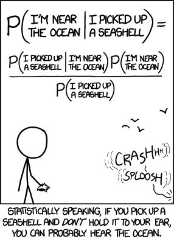
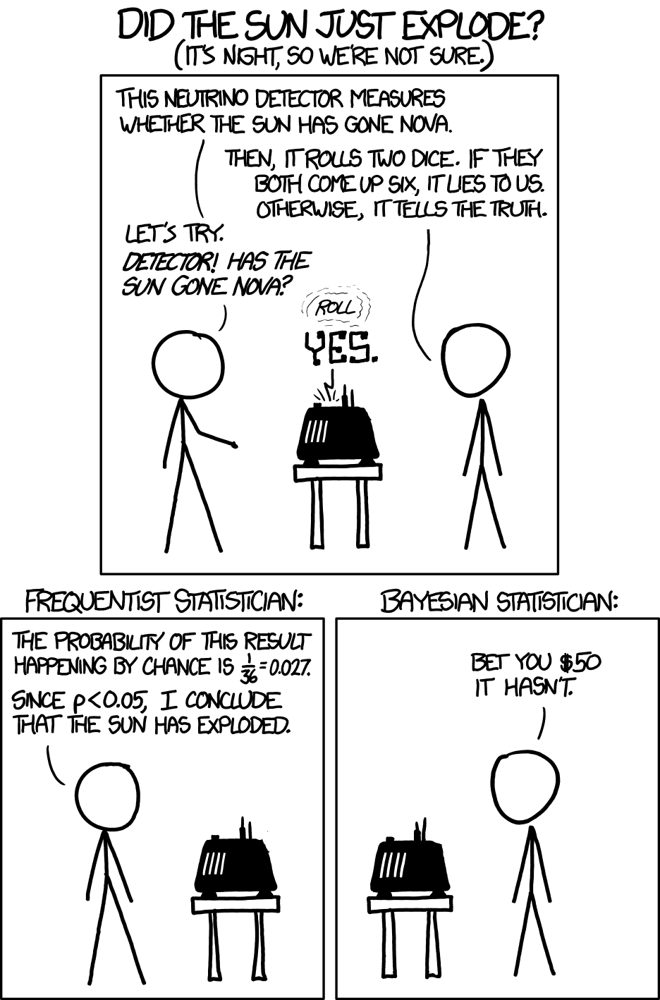
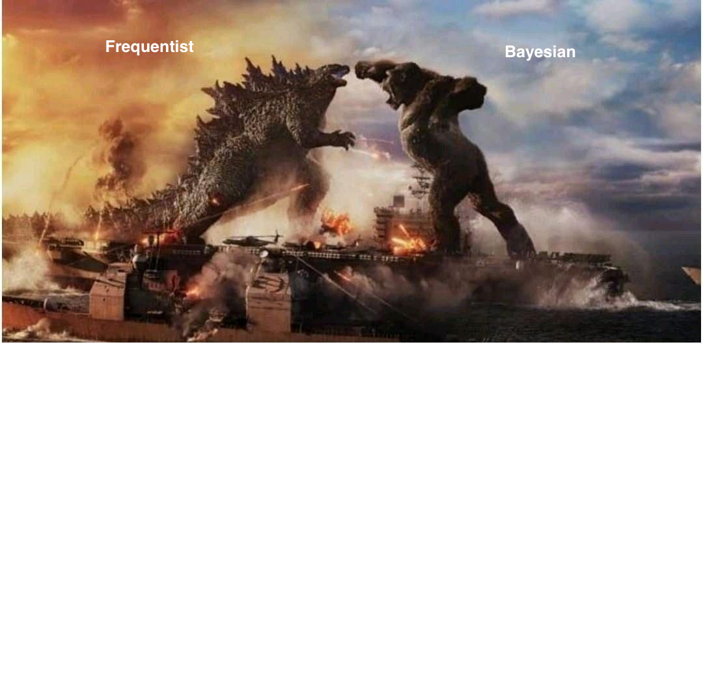
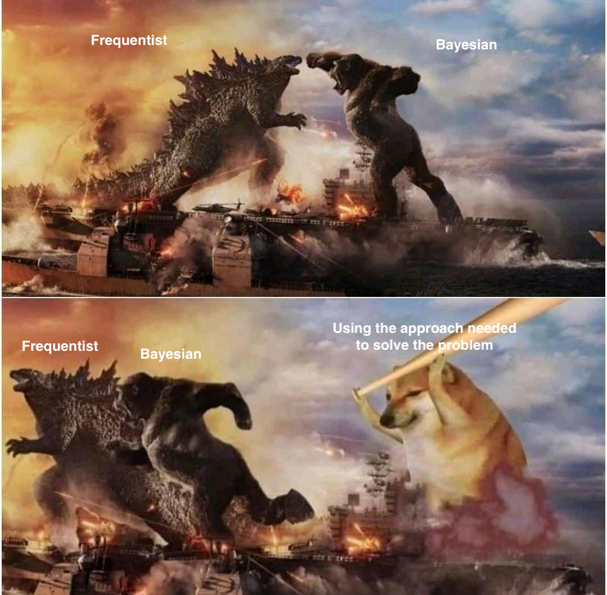
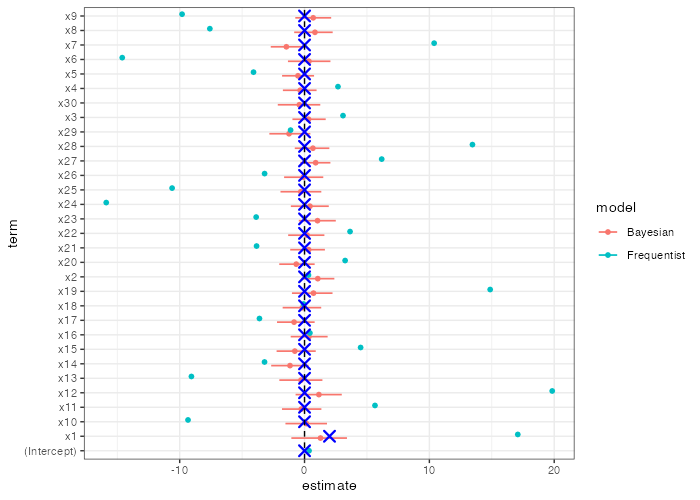
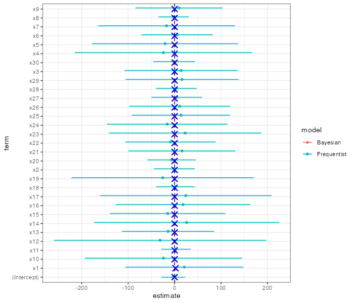
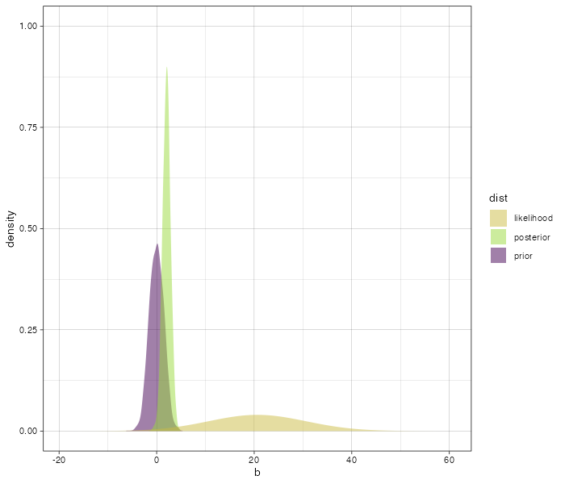

## What is this Bayesian thing anyway? {.center}

**Chat with your neighbor for 3 minutes**:

- Have you heard about Bayesian models/inference/approach?
- If yes, in which context?
- What do you think it means (no guarantee it's the "right" answer, but give it a try!)

## How many have heard about Bayesian inference? 🙋‍♀️🙋 {.center}

## How many already use a Bayesian workflow? 🙋‍♀️🙋 {.center}

## How many have read a paper using Bayesian stats? 🙋‍♀️🙋 {.center}

## How many (of you) understood that paper using Bayesian stats? 🙋‍♀️🙋 {.center}

## Are you ready to get a non-technical introduction? 🎉🥳 {.center}

## Bayes in the style of xkcd



## But why is this different from other stats?



## Is there a fight? {.auto-animate .center}



## Is there a fight? {.auto-animate .center}



## The Core Question {.smaller}

> Why do we need a Bayesian approach to regression? 

Can't we just use ordinary least squares?

The answer is not (only):

-  philosophy
-  elegance
-  a matter of preference

::: {.callout-important appearance="simple" icon=false}
Real regression problems are often weakly identified, noisy, unstable, and geometrically pathological.
:::

## The ultra-quick answer {.center}

Bayesian regression stabilizes inference by:

1. Explicitly stating expectations
2. Constraining parameters, offering regularization 
3. Constraining model, offering stability in parametrization of the model

## When to use Frequentist and when to use Bayesian approaches? {.center}

Frequentist are often sufficient and comparable to Bayesian stats!

## The data
```{r data1}
#| echo: true
set.seed(18062026)

# Data
n <- 100                 # samples
x <- rnorm(n)            # x = N(0,1)      
y <- 2 + 3*x + rnorm(n)  # α = 2, β = 3, ε = N(0,1) 
```

## The models

**Frequentist:**

```{r freq-data1}
#| echo: true
# Frequentist OLS
fit_freq <- lm(y ~ x)
```

**Bayesian:**
```{r bayes-data1}
#| echo: true
# Bayesian regression with flat priors
library(rstanarm)
fit_bayes <- stan_glm(
  y ~ x,
  prior = NULL,            # flat prior on coefficients
  prior_intercept = NULL,
  chains = 2, iter = 2000, refresh = 0
)
```

## What did we find?

**Frequentist:**
```{r data1-freq-results}
#| echo: true
parameters::parameters(fit_freq, ci = 0.95) |> 
  dplyr::select(Parameter, Coefficient, CI, CI_low, CI_high)
```

**Bayesian:**

```{r data1-bayes-results}
#| echo: true
parameters::parameters(fit_bayes, ci = 0.95) |> 
  dplyr::select(Parameter, Median, CI, CI_low, CI_high)
```

## THEN WHY DO WE BOTHER!? {.center}

## When to use Frequentist and when to use Bayesian approaches? {.r-stretch}


## A More Realistic example {.smaller}

:::: {.columns}
::: {.column}
Suppose we have:

-  30 observations
-  10 predictors
-  strong predictor correlation
-  weak signal
-  uncertain mechanisms
:::
::: {.column}
This is extremely common in:

-  social science
-  biology
-  psychology
-  economics
-  policy research
:::
::::

## Simulating Correlated Predictors {.r-stretch}

```{r modeling}
#| echo: false
#| output: false
library(MASS)
library(corrplot)

set.seed(12)

n <- 30
p <- 10

Sigma <- matrix(0.9, p, p)
diag(Sigma) <- 1

X <- mvrnorm(n, mu = rep(0, p), Sigma = Sigma)

colnames(X) <- paste0("x", 1:p)
```

```{r}
#| label: fig-correlation
#| fig-cap: "Correlation structure among predictors."
corrplot(cor(X), method = "color")
```

## The Data Generating Process {.smaller}

The truth is simple.

Only one predictor matters.

$$
y = 1.5x_1 + \epsilon
$$

All other predictors have zero effect.

Yet predictors are highly correlated.


## Talk to your neighbor {.center}

*what do you think will happen*?

- think about the model specification
- does the same happen in the Frequentist and Bayesian models?


## The model results when p=30 and n=30 {.r-strecht}


:::{.fragment}
[x30 doesn't even have an estimate due to unindentifiability!]{style="color: red;"}
:::

## The model results when p=30 and n=32 {.r-strecht}


:::{.fragment}
[coliniarity inflates CIs!]{style="color: red;"}
:::

## The Frequentist Ideal {.smaller .scrollable}

Ordinary Least Squares (OLS):

-  minimizes squared residuals
-  produces unbiased estimators
-  provides confidence intervals and *p*-values
-  works beautifully asymptotically

The classical linear model:

$$
y = X\beta + \epsilon
$$

with

$$
\epsilon \sim \mathcal{N}(0, \sigma^2)
$$

OLS estimator:

$$
\hat{\beta}_{OLS} = (X^TX)^{-1}X^Ty
$$

## The Hidden Assumption

OLS works well when:

-  predictors are not highly collinear
-  sample size is large
-  signal-to-noise ratio is reasonable
-  parameters are strongly identified

But real data often violate all of these simultaneously.

## The Mechanism of Failure {.smaller}

With correlated predictors:

-  many coefficient combinations fit equally well
-  the likelihood becomes nearly flat
-  tiny noise changes estimates dramatically

OLS asks:

::: {.callout-note appearance="simple" icon=false}
Which coefficients minimize prediction error?
:::

But it never asks:

::: {.callout-warning appearance="simple" icon=false}
Are these coefficient magnitudes plausible?
:::


## The Geometry Problem

Collinearity creates unstable directions in parameter space.

The matrix:

$$
(X^TX)^{-1}
$$

becomes nearly singular.

As a result:

-  coefficients explode
-  signs flip
-  uncertainty becomes enormous
-  interpretation collapses

## The Bayesian Solution

Bayesian regression adds prior information:

$$
\beta_j \sim \mathcal{N}(0,1)
$$

Posterior:

$$
p(\beta \mid y)
\propto
p(y \mid \beta)p(\beta)
$$

The prior regularizes weakly identified directions.

This changes the geometry of inference.

## Important Clarification

Bayesian priors are not magic.

They encode structural skepticism.

The prior says:

::: {.callout-tip appearance="simple" icon=false}
Large coefficients should require strong evidence.
:::

This is often scientifically reasonable.

## Explaining the simulation Setup

We simulated the failure directly:

-  small sample
-  many predictors
-  high collinearity
-  weak signal

## Frequentist OLS


## Why This Happens

Predictors are interchangeable.

The model can fit equally well using:

-   huge positive x1
-   huge negative x2

OLS has no mechanism preventing absurd parameter values.

It only optimizes fit.

## The Frequentist Interpretation Problem

Researchers now face impossible interpretation.

Questions become unstable:

-   Which variables matter?
-   Which signs are trustworthy?
-   Which effects are real?

*p*-values fluctuate wildly across samples.


## Bayesian Regression


## Let's have a look 



## What the Prior Does

The prior shrinks implausible coefficients toward zero.

Not aggressively.

Just enough to stabilize weakly identified directions.

This is called:

-   regularization
-   shrinkage
-   partial pooling of uncertainty

## Bias-Variance Tradeoff

Frequentist OLS emphasizes unbiasedness.

But unbiased estimators can have enormous variance.

Bayesian regression accepts:

-   tiny bias
-   dramatically lower variance

This often improves:

-   prediction
-   calibration
-   scientific interpretation

## The Deep Point

OLS treats the model as fixed truth.

Bayesian workflow treats models as uncertain approximations.

This distinction is profound.

## Posterior Interpretation

Frequentist confidence interval:

::: {.callout-warning appearance="simple" icon=false}
Does NOT mean:
"There is a 95% probability the parameter lies here."
:::

Bayesian posterior interval:

::: {.callout-important appearance="simple" icon=false}
Literally means:
"Given model and data, there is 95% posterior probability the parameter lies here."
:::

## Weak Identification

The Bayesian posterior honestly expresses:

-   uncertainty
-   partial identifiability
-   lack of information

Sometimes the correct scientific answer is:

::: {.callout-note appearance="simple" icon=false}
"We do not know very much."
:::

OLS often hides this instability behind noisy point estimates.

## Posterior Predictive Thinking

Bayesian models naturally support:

-   posterior predictive checks
-   hierarchical models
-   measurement error
-   causal modeling
-   uncertainty propagation

This enables model criticism rather than blind estimation.

## A More Extreme Failure

Increase:

-   predictors from 10 to 20
-   correlation from 0.9 to 0.95

OLS becomes nearly meaningless.

Coefficients:

-   explode
-   reverse sign
-   become sample-dependent noise

Bayesian regularization still produces stable inference.

## The Core Mechanism

Frequentist OLS:

$hat{β}$ =arg min RSS

Bayesian regression:

$$
p(\beta \mid y)
\propto
p(y \mid \beta)p(\beta)
$$

The prior changes the geometry of inference.

This is the key idea.

## Final Takeaway

Bayesian regression matters because:

-   real models are weakly identified
-   finite samples are noisy
-   predictors are correlated
-   unconstrained likelihoods become pathological

Priors repair inferential geometry.

## Final Thought

The Bayesian question is not:

::: {.callout-note appearance="simple" icon=false}
"What coefficient minimizes error?"
:::

The Bayesian question is:

::: {.callout-important appearance="simple" icon=false}
"What parameter values remain plausible after combining data with scientific structure?"
:::

That is usually the more meaningful scientific question.

## References {#sec-references}

- Gelman, A., et al. Bayesian Data Analysis
- McElreath, R. Statistical Rethinking
- Vehtari, A., Gelman, A., Gabry, J. (2017) "Practical Bayesian model evaluation using leave-one-out cross-validation"
- Hastie, Tibshirani, Friedman. Elements of Statistical Learning

## Exercise:

See exercises at website...